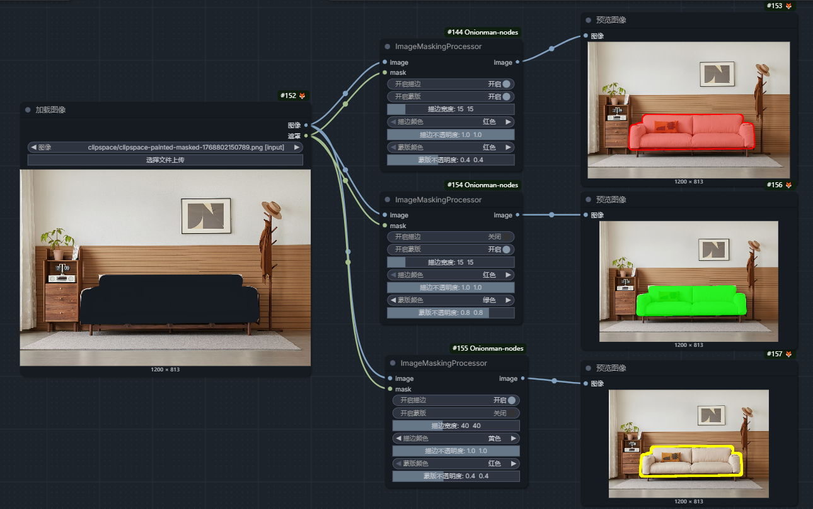
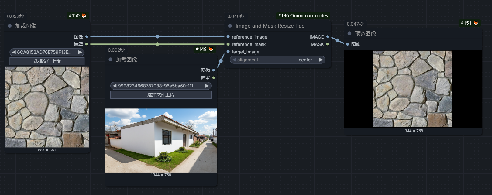
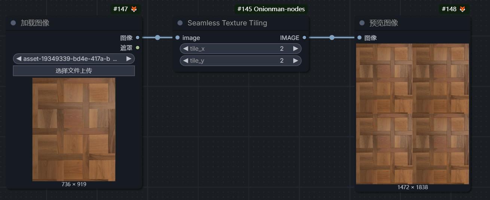

# ComfyUI-Onionman-Nodes

[English Version](#english-version) | [中文版本](#中文版本)

A custom node suite for ComfyUI focusing on image pre-processing, masking, and texture tiling.
一个专注于图像预处理、遮罩编辑和材质平铺的 ComfyUI 自定义节点组件包。

---

## 🌟 Features / 功能特性

### 1. ImageMaskingProcessor (图像遮罩处理器)
**English:**
This node processes user-uploaded masks and base images. It allows you to visualize the mask on the image as an overlay, an outline (stroke), or both.
- **Customization:** Fully adjustable color, opacity, and stroke width.
- **Use Case:** Perfect for pre-processing images before sending them to inpainting models, or for automating data preparation for model training.

**中文:**
该节点可以将用户上传的遮罩和底图进行加工。根据设置，可以将遮罩显示为“蒙版填充”、“边缘描边”或两者结合，并附着在底图上。
- **自定义:** 支持随意更改颜色、透明度以及描边的宽度。
- **使用场景:** 方便用户在使用支持图像编辑的AI模型时对图片进行预处理，或者在训练模型时对图片进行自动化标注/处理。




### 2. Image and Mask Resize Pad (图像与遮罩尺寸对齐补全)
**English:**
This node resizes and pads a source image (and its mask) to match the dimensions of a reference target image.
- **Logic:** Padding is filled with black color to ensure the source image's aspect ratio matches the target image exactly.
- **Use Case:** Essential when calling multi-image input APIs (like Nano Banana or others). It prevents issues where the API uses the last image's aspect ratio for the final output, ensuring your reference image doesn't distort the generation result.

**中文:**
该节点可以将“图1”以及它的“遮罩”根据“图2”的尺寸进行补充扩展。
- **逻辑:** 补充位置用黑色填充，强制让图1的尺寸与图2完全对齐。
- **使用场景:** 方便用户在调用一些支持多图输入的API时调整图片使用。例如某些API（如 Nano Banana）会以最后一张传入图片的尺寸作为最终出图比例，使用此节点可以避免参考图影响最终出图比例导致效果变差。



### 3. Seamless Texture Tiling (材质无缝平铺)
**English:**
A simple but useful utility that tiles a texture image based on X and Y coefficients.
- **Function:** Repeats the input image to create a tiled pattern (e.g., 2x2 grid).
- **Use Case:** Quickly visualizing texture repeats or generating large-scale background patterns.

**中文:**
这是一个简单实用的节点，能帮用户根据设置的 X*Y 系数把材质贴图平铺成相应的样子。
- **功能:** 例如设置 2x2，即可将贴图重复平铺。
- **使用场景:** 快速预览材质纹理效果或生成大尺寸背景底图。



---

## 🔧 Installation / 安装

### Method 1: ComfyUI Manager (Recommended)
1. Search for `Onionman` in ComfyUI Manager.
2. Click Install.

### Method 2: Manual Installation
1. Navigate to your ComfyUI `custom_nodes` directory.
2. Run the following command:
   ```bash
   git clone https://github.com/Onionman61/ComfyUI-Onionman-Nodes.git
3.  Restart ComfyUI.

## Credits
Created by Onionman.
